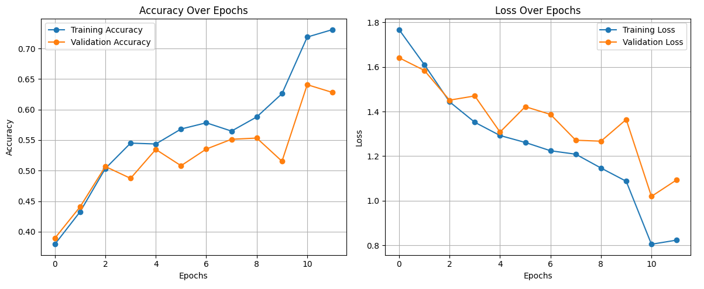
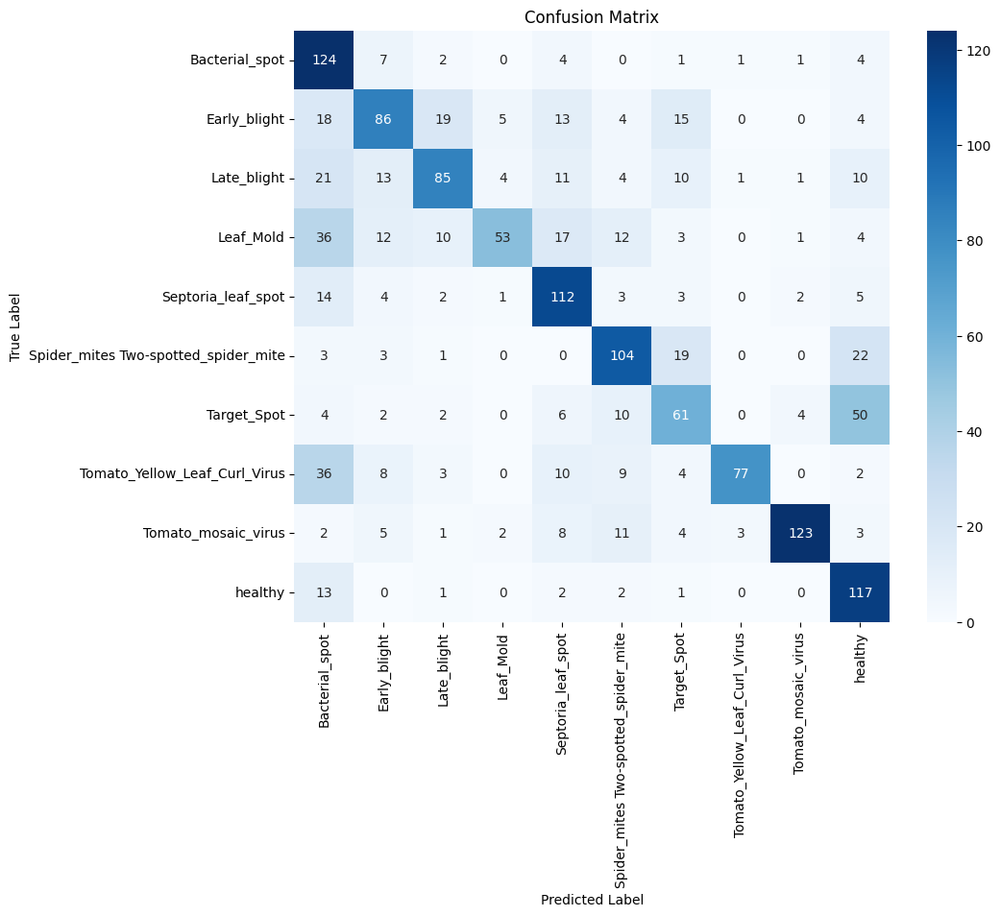
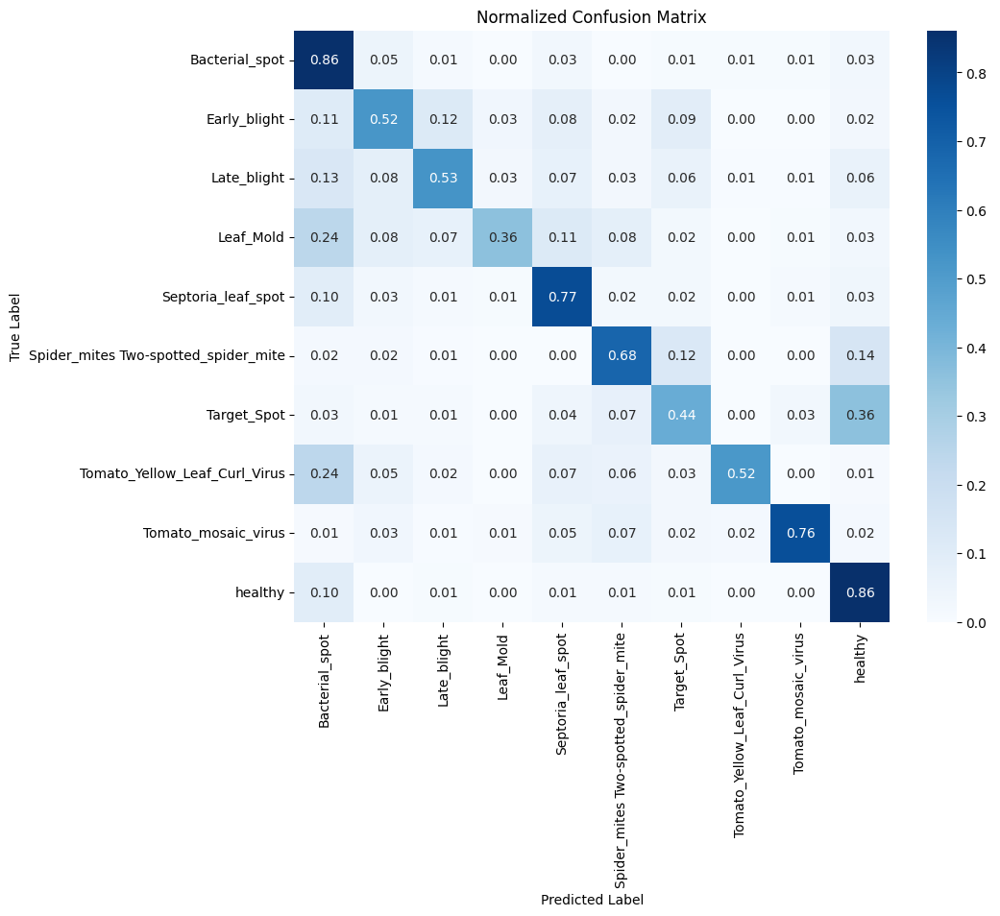

# Grapher Notebook Documentation

This document provides an overview of the `grapher.ipynb` notebook, which is part of the Plantesa-training project.

## Purpose

The `grapher.ipynb` notebook is designed to visualize and analyze data generated during the training and evaluation of machine learning models. It helps users gain insights into model performance through various plots and graphs.

## Features

- **Data Loading:** Import training logs, metrics, or results from CSV, JSON, or other supported formats.
- **Visualization:** Generate plots such as loss curves, accuracy trends, confusion matrices, and more.
- **Customization:** Adjust plot styles, labels, and axes for better readability.
- **Export:** Save generated graphs as image files for reports or presentations.

## Usage

1. **Open the Notebook:**  
    Launch `grapher.ipynb` in Jupyter Notebook or JupyterLab.

2. **Configure Data Source:**  
    Update the data loading cells to point to your results or logs.

3. **Run Visualization Cells:**  
    Execute the notebook cells to generate and view the plots.

4. **Save or Export:**  
    Use the provided code to save figures as needed.

## Example Plots

- Training and validation loss over epochs
- Model accuracy comparison
- Confusion matrix for classification results

## Requirements

- Python 3.x
- `matplotlib`
- `pandas`
- `seaborn` (optional, for enhanced visuals)

Install dependencies with:

```bash
pip install matplotlib pandas seaborn
```

## Customization

You can modify the notebook to add new plots or adjust existing ones to fit your specific analysis needs.

## Results

### 1. Graph on the Training and Validation Loss

The following plot illustrates the training and validation loss over epochs. This graph helps identify how well the model is learning and whether it is overfitting or underfitting.



**Explanation:**  
- The x-axis represents the number of epochs.
- The y-axis shows the loss value.
- The training loss (blue line) typically decreases as the model learns.
- The validation loss (orange line) indicates how well the model generalizes to unseen data.
- If the validation loss starts increasing while the training loss continues to decrease, it may indicate overfitting.

You can generate this plot by running the corresponding cell in the notebook after loading your training log data.

### 2. Confusion Matrix for Classification Results

The confusion matrix visualizes the performance of a classification model by showing the counts of true and predicted labels for each class.



**Explanation:**  
- Rows represent the actual classes, and columns represent the predicted classes.
- The diagonal elements indicate correct predictions.
- Off-diagonal elements show misclassifications.
- A well-performing model will have higher values along the diagonal.
- The confusion matrix helps identify which classes are being confused by the model.

You can generate this plot by running the confusion matrix cell in the notebook after evaluating your model on the test data.

### 3. Normalized Confusion Matrix

The normalized confusion matrix provides a clearer view of classification performance by displaying the proportion of predictions for each class, rather than raw counts.



**Explanation:**  
- Each cell shows the percentage of predictions for a given actual class that were assigned to each predicted class.
- Values in each row sum to 1 (or 100%), making it easier to compare performance across classes with different sample sizes.
- High values along the diagonal indicate strong performance, while off-diagonal values highlight specific misclassification patterns.
- Normalization helps identify subtle issues that may be masked in the raw confusion matrix.

You can generate this plot by running the normalized confusion matrix cell in the notebook after evaluating your model on the test data.

---

For questions or contributions, please refer to the project repository.